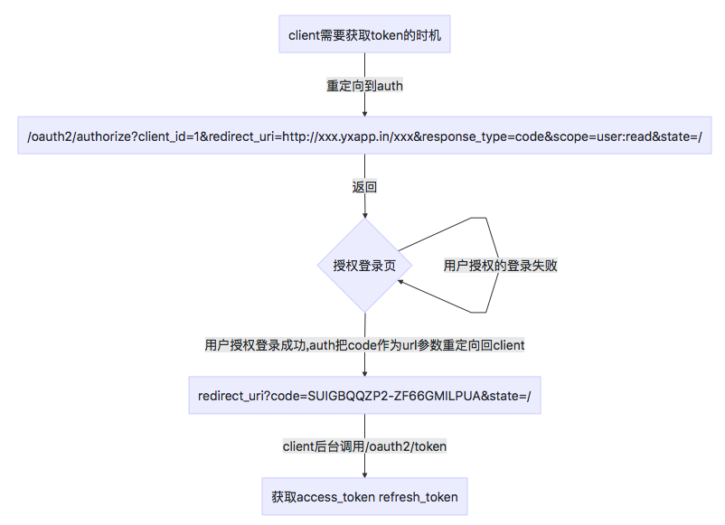

# oauth2接口

[1. 请求authorize 获取code](#1-请求authorize-获取code)  
[2. 使用code获取access token 以及 refresh token](#2-使用code获取token)  
[3. 使用refresh token刷新access token](#3-使用refresh-token获取新token)  

**Oauth2获取token流程**  


## 1. 请求authorize 获取code

当接入auth的网站需要获取token，主动重定向到该路径下（GET），此时会返回授权登录页面, 用户登录以后auth会请求url中填写的回调地址，并传入code

**重定向地址**  
  `GET /oauth2/authorize?client_id=1&redirect_uri=http://xxx.com/xxx&response_type=code&scope=all:all&state=somestate`

**url请求参数**

字段名 |变量名 | 是否必填 | 类型 | 示例 | 描述 |
---| --- | --- | --- | --- | --- |
client_id|client的id|是|int|1|
redirect_uri|重定向uri|是|string|http://xxx.com/xxx
response_type|类型|是|string|固定为code|
scope|权限范围|是|string|all:all|
state|临时状态|否|string|somestate|通常可记录跳转前所在页面路径

**scope说明**  
目前支持如下scope，使用多个scope时候以单个空格间隔拼成字符串，all:all表示授权全部scope

- role:read
- role:write
- role-user:read
- role-user:write
- role-resource:read
- role-resource:write
- resource:read
- resource:write
- user:read
- user:write
- client:read
- client:write
- group:read
- group:write
- groupuser:read
- groupuser:write
- all:all

## 2. 使用code获取token

**接口地址及请求方式**  
  `POST /oauth2/token?redirect_uri=http://xxx.com/xxx&grant_type=authorization_code&code=MA0L8JYSNWO8CLSXZ3OTVG`

**url请求参数**

字段名 |变量名 | 是否必填 | 类型 | 示例 | 描述 |
---| --- | --- | --- | --- | --- |
redirect_uri|重定向uri|是|string|http://xxx.com/xxx
grant_type|类型|是|string|固定为authorization_code|
code|临时授权凭证|是|string|MA0L8JYSNWO8CLSXZ3OTVG|

Header 中需要如下信息:  

```json
  "Authencation": "Client (jwt token)"
```

jwt token 内容见 [authority 文档](authority.md)

**返回结果示例**

成功

```json
{
    "access_token": "RES_PGX0OUW0R6J14OQUBG",
    "expires_in": 7200,
    "refresh_token": "8HRFHV2IUQ6UQXPIKWLWVA",
    "scope": "all:all",
    "token_type": "Bearer"
}
```

失败

```json
{
    "error": "server_error",
    "error_description": "The authorization server encountered an unexpected condition that prevented it from fulfilling the request"
}
```

### 3. 使用refresh token获取新token

**接口地址及请求方式**  
  `POST /oauth2/token?grant_type=refresh_token&refresh_token=HZDQI4_YWE6LFFP_NT0NRQ&scope=all:all`

**url请求参数**

字段名 |变量名 | 是否必填 | 类型 | 示例 | 描述 |
---| --- | --- | --- | --- | --- |
redirect_uri|重定向uri|是|string|http://xxx.com/xxx
grant_type|类型|是|string|固定为refresh_token|
refresh_token|fresh token|是|string|HZDQI4_YWE6LFFP_NT0NRQ|
scope|权限范围|是|string|all:all|原scope或原scope的子集

Header 中需要如下信息:  

```json
    "Authencation": "Client jwt token"
```

**返回结果示例**  
成功

```json
{
    "access_token": "RES_PGX0OUW0R6J14OQUBG",
    "expires_in": 7200,
    "refresh_token": "8HRFHV2IUQ6UQXPIKWLWVA",
    "scope": "all:all",
    "token_type": "Bearer"
}
```

失败

```json
{
    "error": "server_error",
    "error_description": "The authorization server encountered an unexpected condition that prevented it from fulfilling the request"
}
```
