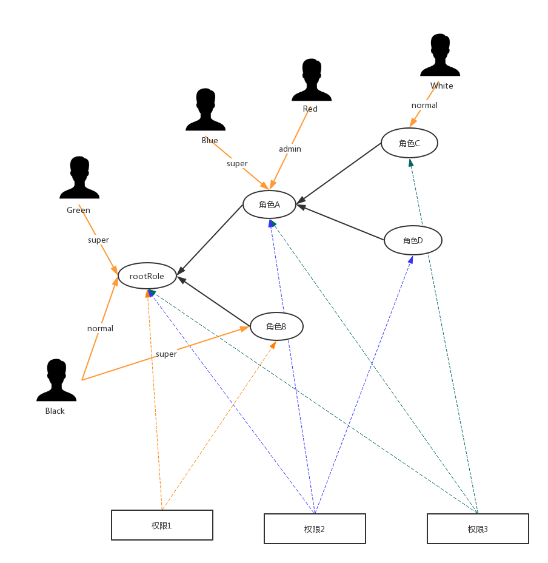

**角色树定义如下**：
1. 角色树的根节点是应用管理员角色（rootRole，创建client时，自动生成），该角色是该client下所有角色的祖先，可以修改名称但不允许删除
2. 角色树结构的改变允许四种操作：
(1) 创建子角色（以没有关联权限的角色为父角色）
(2) 修改某个角色的名称、描述
(3) 删除非根角色
(4) 在某个角色与其子角色之间插入一个新角色
3. 删除角色
(1) 如果该角色是叶子节点，那么从角色树中移除该角色，并自动断开与权限和用户的关联
(2) 如果该角色是非叶子节点，那么从角色树中移除该角色，该角色的子角色自动成为该角色的父角色的子角色 （ A - B -C  删除B 后变为 A-C）

**角色-权限的关联关系定义如下**
1. 角色树与权限之间是多对多关系，其中根节点关联全部权限（创建权限时自动关联，不允许解除关联）
2. 子角色的权限集合是父角色的权限子集

**角色-用户的关联关系定义如下**
1. 用户可以加入任意角色中，在一个角色中，用户可以有三种身份：普通用户（normal）或管理员身份（admin）或超级管理员身份（super）
2. 用户若在某个角色内，那么相当于用户加入了以该角色为根的角色子树中的每一个角色（若用户在子树中若有更高身份的角色，则不继承父角色身份），同时继承在上层角色中的身份（上层若是管理员，那么子树下全部角色都相当于管理员）

**用户在角色中身份的说明**
1. 普通成员（normal），拥有所在角色关联的全部权限
2. 管理员（admin），拥有所在角色关联的全部权限，且可以管理以该角色为根的子树的成员（除super成员）
3. 非根角色的超级管理员，拥有所在角色关联的全部权限，可以管理以该角色为根的子树的成员（除super成员），且可以在以该角色为根的子树（不可修改该角色本身）下新增、修改、删除角色或修改角色与权限的关联关系
4. 根角色的超级管理员（rootRoleSuper），拥有应用下全部权限，可以管理全部角色的成员（normal,admin和super），且可以任意新增、修改、删除角色或修改权限的关联关系（根角色不允许删除，不允许修改权限的关联关系）

**设计初衷和关键点**：
1. 能够清楚的看出来一个client下的角色和权限是如何组织的（一定程度实现类似角色继承的概念，但维持了树形结构）
2. 避免用户-组架构下，需要硬编码判断用户有什么权限（例如，用户在某某组，那么可以使用某某功能）
3. 在auth这种权限架构下，可以便捷的组织用户-角色树-权限三者的关系，当鉴权时候可以方便的查询用户-权限二者的关系（当然也可以根据需求判断用户在不在某个角色，或者是不是某个角色的管理员）

**下面以一个例子进行说明：**

在上图中：
- Green是rootRole的super成员，他有权限1-3，可以在管理任意角色的成员，可以任意新增、修改、删除角色，可以任意修改权限的关联关系
- Black是rootRole的normal成员，他有权限1-3；Black是角色B的super成员，他有权限1，可以管理以角色B为根的子树的成员（除了super成员），可以在以角色B为根的子树下新增、修改、删除角色，修改权限的关联关系
- Blue是角色A的super成员，他有权限2-3，可以管理以角色A为根的子树（即A,C,D）的成员（除了super成员），可以在以角色A为根的子树（即A,C,D）下新增、修改、删除角色，修改权限的关联关系
- Red是角色A的admin成员，他有权限2-3，可以管理以角色A为根的子树（即A,C,D）的成员（除了super成员）
- White是角色C的normal成员，他有权限3
- rootRole关联了权限1-3（全部权限），角色A关联了权限2-3（rootRole的子集），角色B关联了权限1（rootRole的子集），角色C关联了权限3（角色A的子集），角色D关联了权限2（角色A的子集）