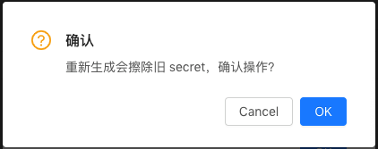

# FAQ

- Q: I am trying to connect server but it exposed error: `unexpected end of JSON input`  
  A: May be your host address forget the protocol scheme likes `http://` or `https://`

- Q: Why ac return me a error response likes 'missing authorise code'  
  A: You should know that oauth2 authorise flow which show in [here](docs/design/oauth2.md#Oauth2获取token流程). Most problem is in your code.  

- Q: Is the response has a standard response code? I need to judge them.  
  A: Not yet. Maybe the `ResCode` in response body could help you a little.

- Q: How do I get the code?  
  A: Code will be passed to your redirect_uri which you filled in your app.

- Q: What should I do when user want to login to my system?  
  A: you could generate a url by `import (oauth2  "code.xxxxx.cn/platform/auth/sdk/golang/custome")` and `url := oauth2.LoginURL("your state")`. Then let user click or redirect it both ok.

- Q: How do I visit api like '/oauth/authorise'?  
  A: You do not need to. Just use sdk's oauth2 package in "code.xxxxx.cn/platform/auth/sdk/golang/custome" and call function `Login`. It could replace the code with user.

- Q: How do I get my user secret?  
  A:   1. click the secret button  
         
       2. click ok button  
         
       3. copy your secret  
         
