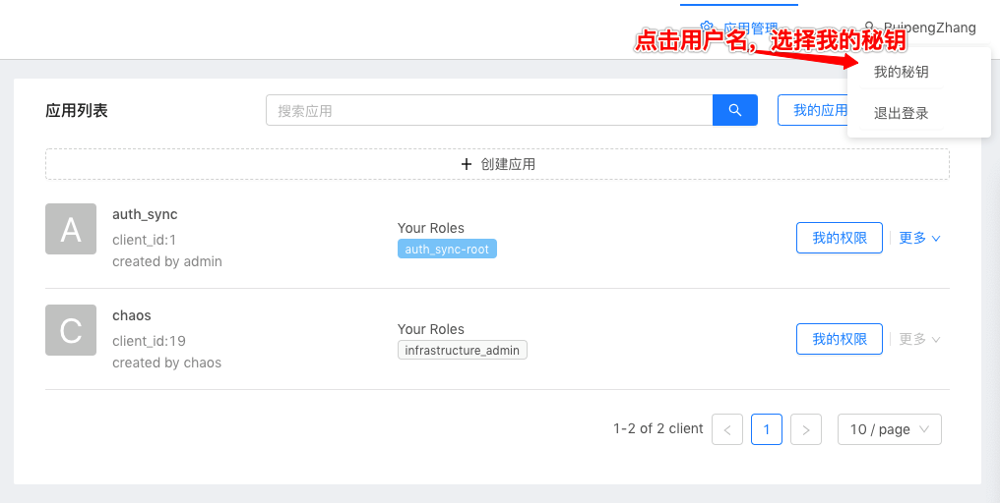
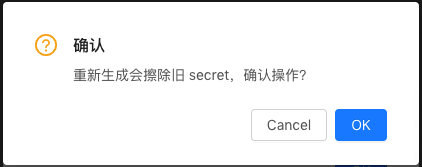
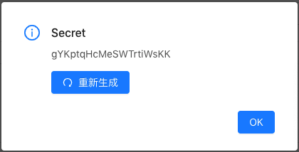

# User manual

## Basic

1. Visit Authority Platform. The default authority platform address is [https://sz-bdy-auth.xxxxx.cn](https://sz-bdy-auth.xxxxx.cn), this platform's accounting system is LDAP. You could use your account to login this platform. (The accounting system will may be different when you use a deployed privately. Contact the Stakeholder)
2. Create your application. Fill in the name and redirect uri（[Oauth2 flow](docs/design/oauth2.md)） to create your app. Click on the application's manage button and find the application secret and client id
3. Save your secret carefully.

## How to use sdk

We will use golang as display language.

Here is detail sdk documents:

- [Python](pythonsdk.md)
- [Golang](golangsdk.md)

### Visit API

To use the sdk, you need import the sdk package in your code:

```go
import (
    authsdk "code.xxxxx.cn/platform/auth/sdk/golang"
)
```

suggest use ssh rather than https to use dep likes:   
`git config --global url."git@code.xxxxx.cn:".insteadOf "https://code.xxxxx.cn/"`

Then use it as below:

```go
func main() {
    // create auth config
    // please do not hardcode the secret
    config := authsdk.APIConfig{
        ClientID:       0, // your id
        ClientSecret:   "123456", // yoursecret
        APIHost:        "https://sz-bdy-auth.xxxxx.cn", // ac platform address
    }
    // create auth client
    authClient := authsdk.NewApiAuth(config)

    // use the client
    client, err := authClient.GetClient()
    if err == nil {
        // Bingo! do what you want to do.
    }
}
```

### Authority Management

Currently, you need to design your roles tree by yourself, and using the roles tree to manage your user authority.  
The API includes:(in sdk)

**Client**

- GetClient
- UpdateClient
- GetClientByUser

**Role**

- AddRole
- GetAllRole
- UpdateRole
- DeleteRole

**User and Role**

- AddUserToRole
- GetUsersOfRole
- GetUserRoles
- UpdateUserOfRole
- DeleteUserFromRole

**Resource**

- AddResource
- GetAllResources
- UpdateResource

**Role,Resource and User**

- AddRoleResourceRelations
- GetResourceByRole
- GetUserResources
- GetAllRoleResourceRelatedInfo
- GetRoleResourceRelatedInfo
- UpdateRoleResourceRelations
- DeleteRoleResourceRelations

- CheckThirdToken

Besides, you could orgnize your user by group.
The API includes:(in sdk)

**Group**

- CreateGroup
- GetGroup
- GetAllGroup
- UpdateGroup
- DeleteGroup

**Group and User**

- CreateGroupUser
- GetGroupsByUserID
- GetUsersByGroup
- DeleteGroupUser

### User Login

Same as before, we will use go as display language.

we provide a simple package for you to do oauth steps.

Firstly, import the sdk

```go
import (
    authcustome code.xxxxx.cn/platform/auth/sdk/golang/custome
)
```

Secondly, route the redirect uri which filled when you create your application to your controller and pass the code in param to Login function.  
If you dont know how to get the code, you could generate a link by `authcustome.LoginURL("state string")` and let broswer to redirect this link when user want to login.  
Then you will get the code in the redirect uri api.

```go
config := authcustome.OauthConfig{
	ClientId:     *clientID,
	ClientSecret: *clientSecret,
	RedirectUri:  "",
	Host:         *authHost,
	Scope:        *authScope,
}
service := authcustome.NewAuthService(config)
user, err := service.Login(code)
// OR your could get user by username and secret
// user, err := service.LoginBySecret("username", "user secret")
// your could find user secret in faq which listed below.

```

The user you could get only includes some basic infomation, you need do some extend operations to get more info like `LoadUserResource`

```go
res, err := service.LoadUserResource(user)
```

---------------
**More exmaple is in [here](sdk/golang/example/example.go)**

Suppose your app config is this:
```json
{
    "id": 2,
    "secret": "anpfEJX5ZtrbI792_ecZvw",
}
```
And the ac address is `http://172.16.244.6:30099`

Then example image usage: `docker run --rm -p 9090:9090 registry.xxxxx.cn/platform/auth_example:golang ./example -id=2 -secret=anpfEJX5ZtrbI792_ecZvw -host=http://172.16.244.6:30099 -local=0.0.0.0:9090`

## Use API

### Visit standard API

When you want to visit any api whose the path start with '/api', you need to add a header to your request like this:

```json
  "Authorization": "Client {your jwt token}"
```

or

```json
  "Authorization": "Bearer {your access token}"
```

The jwt token could generated by you client secret, and the access token need you visit oauth2 api to exchange with code.

JWT token should has a json payload like this:

```json
  {
      "time": "unix time string, should be filled in current time",
      "id": "your client id string",
      "nonce": "a random string, could be ignored"
  }
```

And you need to sign your payload with you client secret.  
Notice that never transfer you secret in any request directly.  
As for access token, please see [User Login](#api-user-login)

### API Authority Management

Same as [Authority Management](#authority-management), But you need to use by restful API.

You could read documentation [here](docs/design/authority.md)

### API User Login

You could read documentation [here](docs/design/oauth2.md)

The jwt token which mentioned in this document should be generated same likes above.

## FAQ

More FAQ: [here](faq.md)

- Q: I am trying to connect server but it exposed error: `unexpected end of JSON input`  
  A: May be your host address forget the protocol scheme likes `http://` or `https://`

- Q: Why ac return me a error response likes 'missing authorise code'  
  A: You should know that oauth2 authorise flow which show in [here](docs/design/oauth2.md#Oauth2获取token流程). Most problem is in your code.  

- Q: Is the response has a standard response code? I need to judge them.  
  A: Not yet. Maybe the `ResCode` in response body could help you a little.

- Q: How do I get the code?  
  A: Code will be passed to your redirect_uri which you filled in your app.

- Q: How do I get my user secret?  
  A: 1. click the secret button    
         
     2. click ok button     
         
     3. copy your secret    
       
